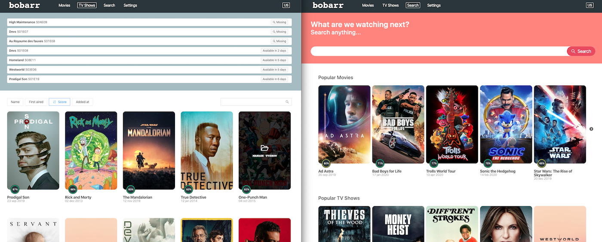

# 🍿 Bobarr
> The all-in-one alternative for Sonarr, Radarr, Jackett... with a VPN and running in docker

Bobarr is a movies and tv shows collection manager for BitTorrent users. It uses [themoviedb.org](https://www.themoviedb.org/) to search movies and tv shows to add to your library. Then it searchs into your favorites torrent trackers the best match and downloads it for you through a VPN.



**This is a beta release!**

### Need help? Join the discord => https://discord.gg/PFwM4zk

## Why ?

One of the main idea for bobarr is to be simple to setup, simple to use and having everything at the same place.
You don't have to choose a torrent client, to setup a VPN, to setup radarr, sonarr, then jackett and connect them all together.

It's also built from scratch and it will try to solve long term problem like download multiple qualities and keep them or managing tvshows and movies at the same place.
You can follow the [roadmap](https://github.com/iam4x/bobarr/projects/1) to check what next features are implemented.

And to have something with a better ui, less configuration and faster 🚀

## Setup

### Requirement

* [docker](https://get.docker.com/) installed with [docker-compose](https://docs.docker.com/compose/install/).

## Installation

Run the installation script and follow the instructions:
* `curl -o- https://raw.githubusercontent.com/iam4x/bobarr/master/scripts/install.sh | bash`

### Configuration

* Update your config in `.env`

### Link your existing library if any (from Sonarr or Raddar)

* Open `docker-compose.yml` and look for `- ./library:/usr/library`
* Update `./library` to the folder where your (`/movies` & `/tvshows`) are

As example, having:
```
/mnt/storage/
|- movies/
|- tvshows/
```
The line should be: `- /mnt/storage:/usr/library`


## How to start

There are two way to start bobarr stack, first without VPN:

* `$ ./bobarr.sh start`
* Go to http://localhost:9117, add your preferred torrent websites and copy the API Key in top right corner
* Go to http://localhost:3000/settings and update the jackett API key

If you want to enforce all torrent traffic through a VPN:

#### OpenVPN

* Copy your open vpn config file (.ovpn) into the folder `packages/vpn` name it `vpn.conf`
* `$ ./bobarr.sh start:vpn`

If you have NPM you can just run `$ npm run start` or `$ npm run start:vpn`

#### WireGuard

* Copy your wireguard config file (wg0.conf) into the folder `packages/vpn`
* `$ ./bobarr.sh start:wireguard`

## Configuration

### Torrent account

* Go to http://localhost:9117
* Add indexer and follow the steps

### Bobarr configuration

* Go to http://localhost:3000/settings
* Set your region and language according to your torrent tracker
* Create and order your preferred tags found in torrent file (ex: vost, multi, english...)
* Order your preferred qualities to download

## Usage

* After configuration, go to http://localhost:3000/search and just start searching!
* The files will be downloaded into `library/downloads`
* The files will be moved/copied/simlinked (you can set this in settings) and organized into `library/tvshows` or `library/movies`

The only requirement is to have a folder `tvshows` and a folder `movies` then bobarr can catch up and download to your user defined library folder.

If your movies or tvshow folder have a different name, you can edit `.env` file with your folder names:

```
LIBRARY_MOVIES_FOLDER_NAME=movies
LIBRARY_TV_SHOWS_FOLDER_NAME=tvshows
```

You can now head to http://localhost:3000 and hit that "Scan library folder" button.

## How to stop

You can stop the whole bobarr stack with:

* `$ ./bobarr.sh stop`

## How to update

Check the [CHANGELOG](https://github.com/iam4x/bobarr/blob/master/CHANGELOG.md) and update your `.env` if needed with new variables added.

* `$ ./bobarr.sh update`
* `$ ./bobarr.sh start`

## Services

* Bobarr http://localhost:3000
* Bobarr GraphQL API http://localhost:4000/graphql
* Bobarr background jobs http://localhost:4000/jobs
* Jackett http://localhost:9117
* Transmission http://localhost:9091

## Development

Clone the repository and then you can run bobarr API and Web UI in dev watch mode and display logs with:

* `$ yarn dev`
